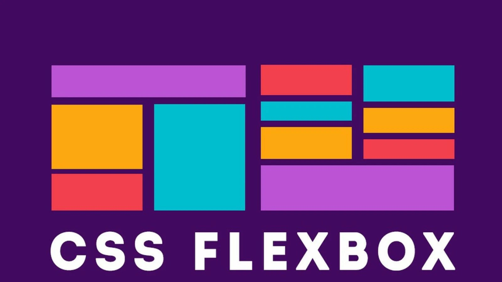

# Flexbox Warrior 🥷

_Frontend Challenges using ONLY Flexbox and Vanilla CSS ⚔️_

**Check the completed challenges by going to their respective branch!**

## Completed Challenges 🎯

1. [✅ QR Code Component](https://qr-code-component-taupe-mu.vercel.app/)
2. [✅ 3 Column Card Component](https://3-column-preview-card-component-lemon-xi.vercel.app/)
3. [✅ Order Summary Component](https://order-summary-component-omega-gold.vercel.app/)
4. [✅ Base Apparel Coming Soon](https://base-apparel-coming-soon.onrender.com)
5. [✅ Stats Preview Card](https://stats-preview-card-miaf.onrender.com)
6. [✅ Four Card Feature](https://four-card-feature.onrender.com)
7. [✅ Product Preview Card](https://product-preview-card-tymj.onrender.com)
8. [✅ News Homepage](https://news-homepage112.onrender.com/)

## Why? 📌

_The reason for this is basically to see how far can you get using Flexbox and how complex can your CSS get, while also learning how to use Flexbox properly._

<!--  -->
